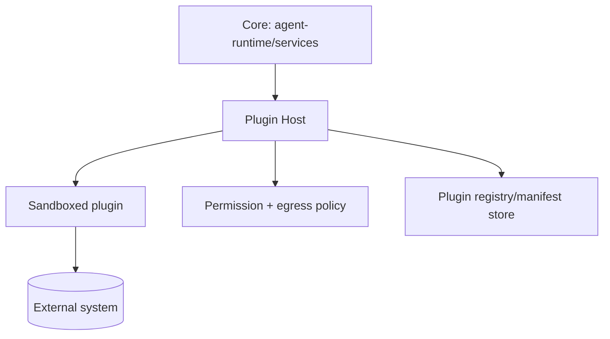

# Plugin Framework

> **Purpose.** Define the plugin SDK/host model: how plugins are structured, declare
> capabilities, and run.

## 1. Plugin Anatomy

- **Manifest:** identity (`dula-plugin-<vendor>-<product>`), version, declared
  capabilities (connectors/tools), required permissions, egress needs, resource limits.
- **Capabilities:** connectors (`<system>.<capability>`) and/or agent tools
  ([./ConnectorStandards.md](./ConnectorStandards.md)).
- **Runtime entry points:** initialize, handle capability calls, health, shutdown.

## 2. Host Model

- The host mediates all calls, enforcing permissions, egress allowlists, and limits; the
  plugin cannot exceed its manifest.

## 3. SDK

- A Plugin SDK (Python-first) provides typed capability contracts, config/secret access
  (scoped via Vault), logging/telemetry, and testing harnesses.

## 4. Isolation

- Sandbox mechanism **REQUIRES DECISION** (container vs WASM vs subprocess); default-deny
  egress; non-root; resource-limited ([./PluginSecurity.md](./PluginSecurity.md)).

## 5. Discovery & Enablement

- Plugins are installed, verified, and enabled per tenant/deployment; capabilities become
  available to services/agents only after enablement.

## 6. Versioning

- Plugins are versioned; capability contracts follow compatibility rules similar to APIs
  ([../12-API/Versioning.md](../12-API/Versioning.md)).
