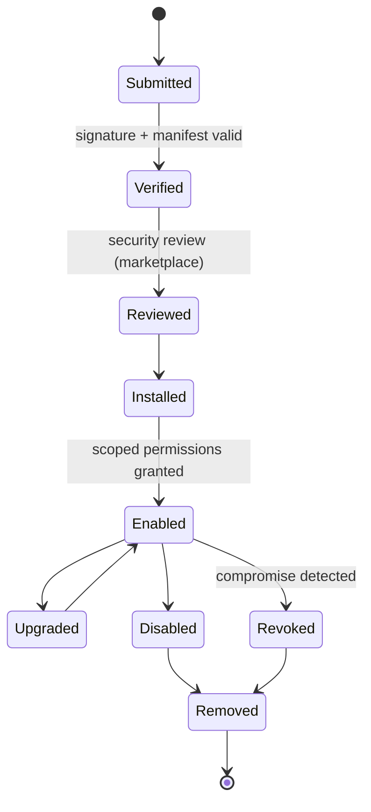

# Plugin Lifecycle

> **Purpose.** Define the lifecycle of a plugin from installation to removal, with security
> gates at each step.

## 1. Lifecycle

## 2. Gates

- **Verify:** signature + manifest schema ([./PluginSecurity.md](./PluginSecurity.md)).
- **Review:** security review for marketplace/third-party plugins.
- **Enable:** grant only manifest-declared, least-privilege permissions.
- **Revoke:** fleet-wide disable of compromised plugins.

## 3. Upgrades

- New signed version verified; permission changes re-reviewed if the manifest requests
  more; rollback supported.

## 4. Air-Gapped

- Install/upgrade via offline bundle import; no external fetch
  ([../11-Deployment/AirGappedDeployment.md](../11-Deployment/AirGappedDeployment.md)).

## 5. Monitoring

- Enabled plugins are monitored (health, resource use, anomalies); alerts feed the incident
  process ([../16-Operations/Monitoring.md](../16-Operations/Monitoring.md)).
