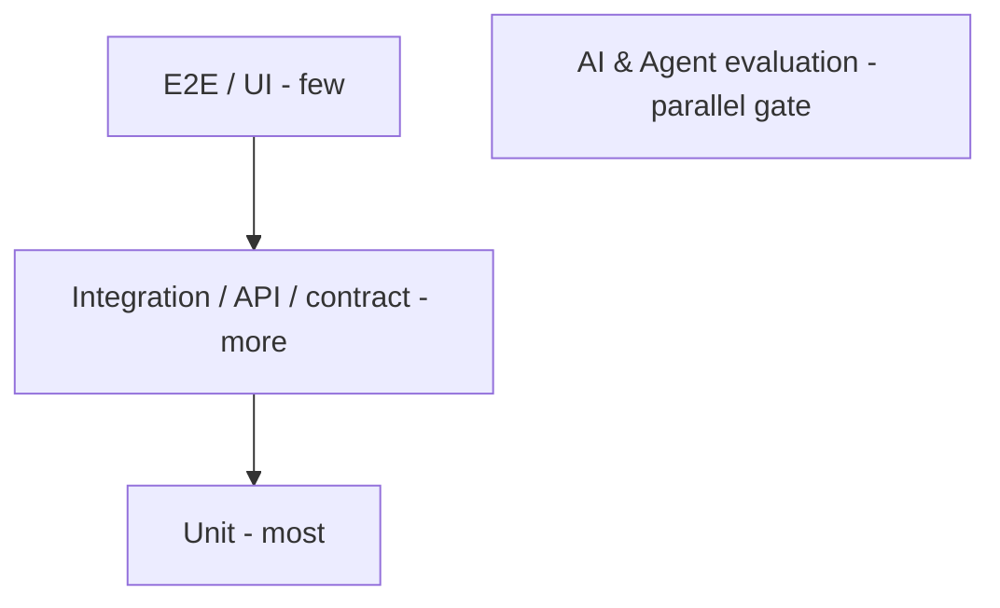

# Testing Strategy

> **Purpose.** Define the overall testing approach, layers, and gates.

## 1. Test Pyramid (+ AI layer)

- Many fast unit tests; fewer integration/contract tests; few E2E; plus an **AI/agent
  evaluation** track that gates AI changes ([./AIEvaluation.md](./AIEvaluation.md)).

## 2. Test Types & Ownership

| Type | Scope | Where |
|------|-------|-------|
| Unit | Functions/modules | [./UnitTesting.md](./UnitTesting.md) |
| Integration | Service + real deps (containers) | [./IntegrationTesting.md](./IntegrationTesting.md) |
| Contract | API/proto conformance | [./IntegrationTesting.md](./IntegrationTesting.md) |
| E2E | User workflows via UI | Playwright |
| Security | SAST/DAST/deps/secrets/red-team | [./SecurityTesting.md](./SecurityTesting.md) |
| Performance/Load | Latency/throughput/capacity | [./PerformanceTesting.md](./PerformanceTesting.md) |
| AI evaluation | Model/RAG quality & safety | [./AIEvaluation.md](./AIEvaluation.md) |
| Agent evaluation | Task success & safety | [./AgentEvaluation.md](./AgentEvaluation.md) |

## 3. Gates (CI)

- Coverage gate (target set per language; **REQUIRES DECISION** on exact %), lint/type,
  security scans, contract tests — all block merge
  ([../00-Governance/RepositoryGovernance.md](../00-Governance/RepositoryGovernance.md)).
- AI/agent changes additionally pass evaluation gates
  ([../09-MLOps/EvaluationPipelines.md](../09-MLOps/EvaluationPipelines.md)).

## 4. Test Data

- Use synthetic/sanitized data; never real customer PII in tests
  ([../10-Security/DataSecurity.md](../10-Security/DataSecurity.md)).

## 5. Environments

- Tests run in CI against containerized deps; E2E against a staging deploy.

## 6. Flakiness & Reliability

- Deterministic tests; quarantine + fix flaky tests; no ignoring failing gates.
