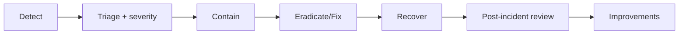

# Incident Management

> **Purpose.** Define how operational and security incidents are detected, triaged,
> resolved, and learned from. (This is about *our platform's* incidents; the product also
> *assists customers* with *their* IR — not to be confused.)

## 1. Incident Types

- **Operational:** outages, degradation, data-tier issues.
- **Security:** suspected breach, secret leak, sandbox escape, unauthorized agent/plugin
  action, supply-chain alert.
- **AI-safety:** model producing unsafe output, agent attempting unauthorized action,
  prompt-injection exploitation.

## 2. Lifecycle

## 3. Severity & Response

- Severity levels with response expectations (**REQUIRES DECISION** on exact SLAs);
  on-call ownership; clear escalation.

## 4. Security & AI Incidents

- Security incidents follow secure-dev/response guidance
  ([../10-Security/SecureDevelopment.md](../10-Security/SecureDevelopment.md)); AI-safety
  incidents can trigger model rollback ([../09-MLOps/ModelLifecycle.md](../09-MLOps/ModelLifecycle.md))
  and agent halt ([../10-Security/AgentSecurity.md](../10-Security/AgentSecurity.md)).

## 5. Communication

- Internal comms + customer notification per contractual/regulatory obligations;
  air-gapped customers handle their own enclave incidents with vendor guidance.

## 6. Post-Incident Review

- Blameless PIR; root cause; action items tracked; runbooks/threat-model updated
  ([./OperationalRunbooks.md](./OperationalRunbooks.md), [../10-Security/ThreatModel.md](../10-Security/ThreatModel.md)).

## 7. Audit

- Incident timeline and actions recorded for accountability.
