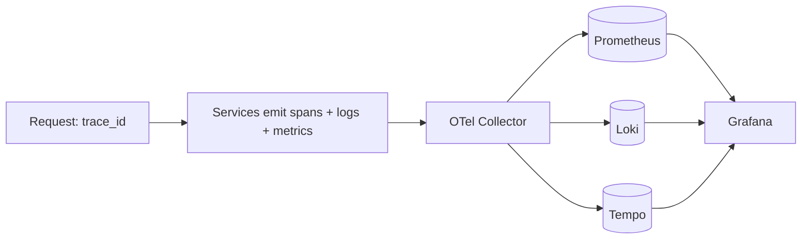

# Observability

> **Purpose.** Define the three pillars — logs, metrics, traces — and how they're collected
> and correlated.
>
> **Delivered (Phase 09):** SLO targets (availability ≥ 99.5%, p95 < 800 ms), Prometheus
> alert/recording rules, and a Grafana dashboard at `deploy/observability/`; the Helm chart ships
> `ServiceMonitor` scaffolding. **Delivered (post-M011):** the application **`/metrics` exporter**
> (`dula_common.metrics`) on `platform-api` and `ai-gateway` — `http_requests_total` /
> `http_request_duration_seconds` per route template, and `ai_call_total` / `ai_call_errors_total`
> / `ai_call_duration_seconds` with a canary-role `provider` label — so the request-level SLI and
> canary-regression rules attach to real series. OpenTelemetry **traces** remain FUTURE (the
> `telemetry` module is still a stub).

## 1. Stack

- **OpenTelemetry** for instrumentation (traces/metrics/logs), exporting to **Prometheus**
  (metrics), **Loki** (logs), **Tempo** (traces), visualized in **Grafana**.

## 2. Correlation

- A single `trace_id`/correlation id links logs, metrics, and traces across services
  ([../12-API/APIStandards.md](../12-API/APIStandards.md)).

## 3. AI Observability

- Track AI-specific signals: tokens, latency (TTFT), model/version used, RAG evidence
  count, guardrail triggers, tool calls — all attributable per request
  ([../03-Architecture/AIArchitecture.md](../03-Architecture/AIArchitecture.md)).

## 4. Data Handling

- Telemetry is classified/redacted; no secrets or sensitive customer data in
  logs/traces ([./Logging.md](./Logging.md), [../10-Security/DataSecurity.md](../10-Security/DataSecurity.md)).

## 5. Air-Gapped

- The full stack runs on-prem/offline; no external APM dependency.

## 6. SLOs

- SLOs/alerts defined in [./Monitoring.md](./Monitoring.md); targets **REQUIRES DECISION**.
