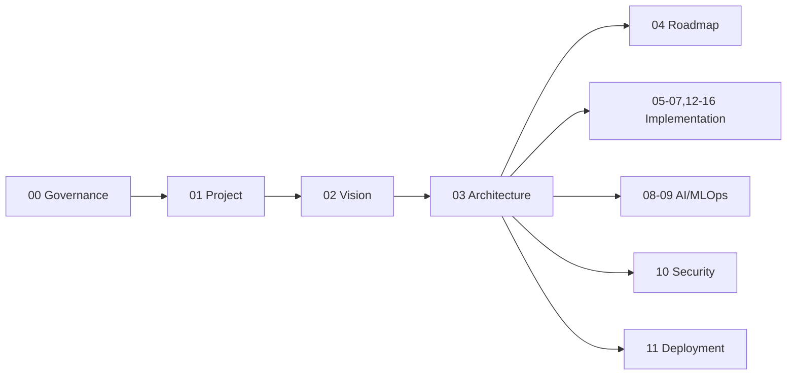

# Dula Engineering Handbook

> **Purpose.** This is the entry point to the Dula engineering documentation. It explains
> what the handbook contains, the order to read it in, and how the areas relate. The goal
> is that a senior engineering team could build the project from these documents without the
> original conversation.
>
> **Status:** Draft (Documentation Bootstrap, M000). Nothing is implemented yet; technology
> choices are ADR candidates and unverified facts are marked **REQUIRES RESEARCH**.

## How to Read This Handbook

1. **Governance (00)** — the rules everything follows (read first).
2. **Project (01)** — glossary, structure, technology stack, dependencies, releases.
3. **Vision (02)** — why we build this, for whom, and non-goals.
4. **Architecture (03)** — the technical design (system, AI, RAG, agent, security…).
5. **Roadmap (04)** — the incremental path from empty repo to advanced Dula AI.
6. **Everything else** — the detailed area docs, referenced from architecture & roadmap.

## Documentation Hierarchy

| Area | Focus | Start here |
|------|-------|-----------|
| [00-Governance](./00-Governance/DocumentationStandards.md) | Rules & process | DocumentationStandards |
| [01-Project](./01-Project/README.md) | Facts: stack, structure | TechnologyStack |
| [02-Vision](./02-Vision/Vision.md) | Purpose & scope | Vision |
| [03-Architecture](./03-Architecture/SystemArchitecture.md) | Technical design | SystemArchitecture |
| [04-MVP-Roadmap](./04-MVP-Roadmap/MVPOverview.md) | Delivery plan | MVPOverview |
| [05-Backend](./05-Backend/README.md) | Backend | ServiceArchitecture |
| [06-Frontend](./06-Frontend/README.md) | Frontend | FrontendArchitecture |
| [07-Database](./07-Database/README.md) | Data model & DB | DataModel |
| [08-AI](./08-AI/README.md) | Dula AI & applied AI | Dula AIStrategy |
| [09-MLOps](./09-MLOps/README.md) | Model lifecycle | ModelLifecycle |
| [10-Security](./10-Security/README.md) | Security | ThreatModel / AIThreatModel |
| [11-Deployment](./11-Deployment/README.md) | Deployment profiles | AirGappedDeployment |
| [12-API](./12-API/README.md) | API standards | Authentication / Authorization |
| [13-Agents](./13-Agents/README.md) | Agents | AgentFramework |
| [14-Plugins](./14-Plugins/README.md) | Extensibility | PluginFramework |
| [15-Testing](./15-Testing/README.md) | Testing & eval | TestingStrategy |
| [16-Operations](./16-Operations/README.md) | Run & operate | Observability |

## Governance

Standards for documentation, code, ADRs, naming, repository/Git, and **AI-assisted
contribution** live in [00-Governance](./00-Governance/DocumentationStandards.md). All docs
follow the metadata and maturity-tagging conventions defined there.

## Architecture, AI, Security, Deployment, Operations

These areas are cross-linked: architecture ([03](./03-Architecture/SystemArchitecture.md))
sets the design; AI/MLOps ([08](./08-AI/README.md)/[09](./09-MLOps/README.md)) detail the
model journey; security ([10](./10-Security/README.md)) constrains everything; deployment
([11](./11-Deployment/README.md)) and operations ([16](./16-Operations/README.md)) make it
runnable and portable (including air-gapped).

## Control Files

- [PROJECT_CONTEXT.md](./PROJECT_CONTEXT.md) — durable project knowledge.
- [PROJECT_STATE.md](./PROJECT_STATE.md) — current execution state.
- [SUMMARY.md](./SUMMARY.md) — complete document index (every file linked).

## Conventions Reminder

Maturity is labeled **CURRENT / MVP / FUTURE / RESEARCH / EXPERIMENTAL**; open items are
**REQUIRES RESEARCH / REQUIRES DECISION**. Almost everything today is MVP/FUTURE — see
[00-Governance/DocumentationStandards.md](./00-Governance/DocumentationStandards.md).
